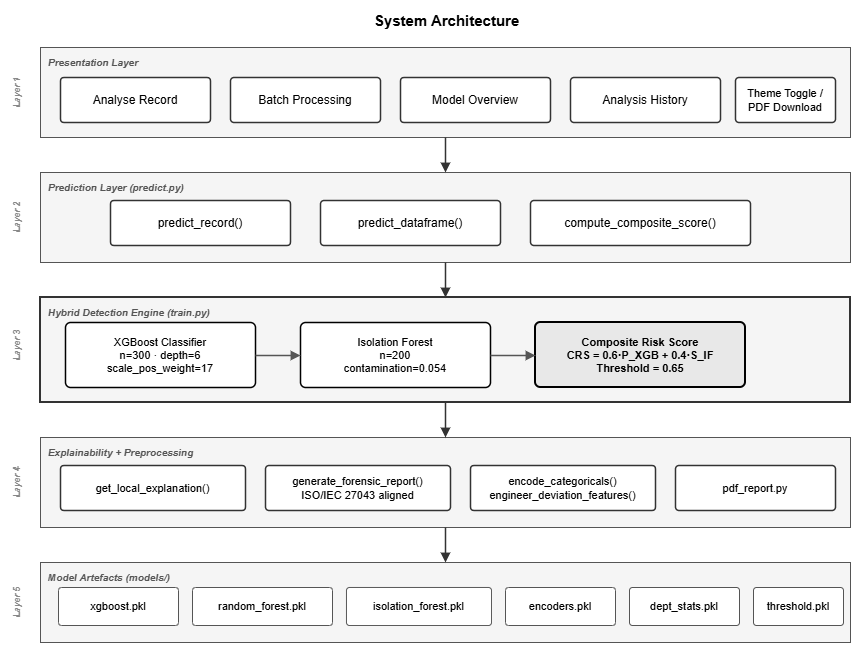
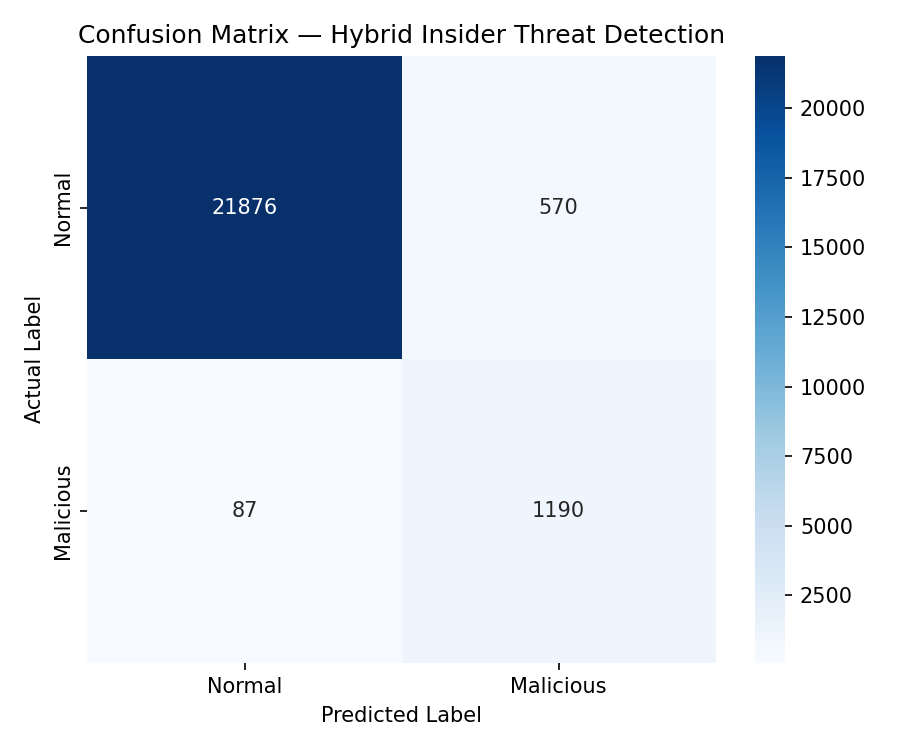
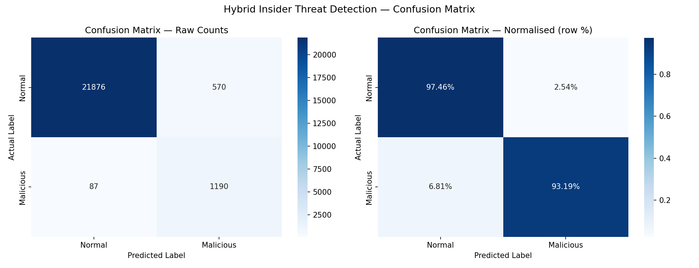
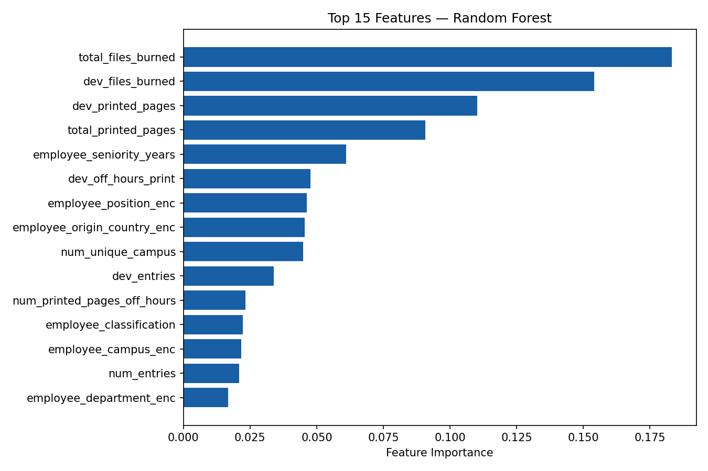
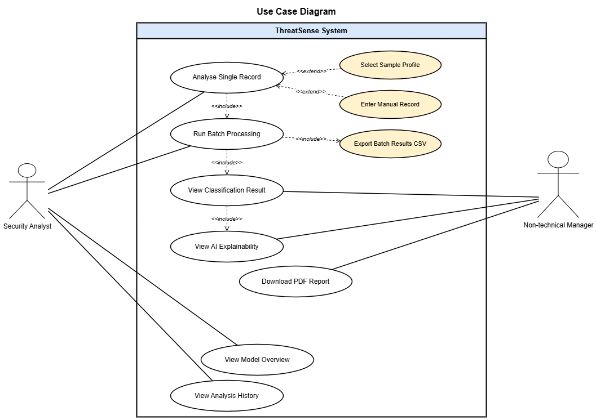
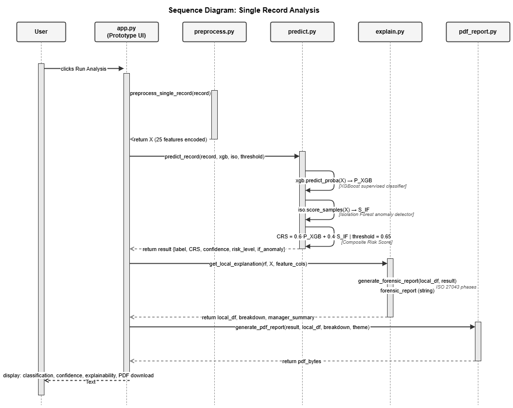

# ThreatSense

**An explainable hybrid machine-learning prototype for insider threat detection and forensic decision support.**

ThreatSense analyses employee behavioural records using a hybrid detection pipeline that combines **supervised classification with anomaly detection**. The system produces a malicious-behaviour probability, a composite risk score, a risk severity level, interpretable risk indicators, and a downloadable forensic investigation report.

This project was developed for **COS720 at the University of Pretoria**.

> **Important:** ThreatSense is a research and educational prototype. Its outputs are probabilistic and are intended to support human investigation, not replace qualified security analysts or serve as the sole basis for disciplinary, employment, or legal decisions.

---

## Overview

Insider threats are difficult to detect because malicious activity can resemble legitimate work. A single unusual event may be harmless, while a combination of smaller behavioural deviations may indicate elevated risk.

ThreatSense addresses this by combining:

- **XGBoost** for supervised malicious/normal classification
- **Isolation Forest** for unsupervised anomaly detection
- **Random Forest** for global feature-importance analysis
- **Department-relative deviation features** for behavioural context
- A **composite risk score** that combines classification probability and anomaly severity
- **Human-readable explanations** and structured forensic reporting
- A **Streamlit interface** for individual and batch analysis

The current risk score is calculated as:

```text
Composite Risk Score
= 0.60 × XGBoost malicious probability
+ 0.40 × normalised Isolation Forest anomaly score
```

The resulting score is mapped to four risk levels:

| Score | Risk level |
|---|---|
| 0–24.9 | Low |
| 25–49.9 | Medium |
| 50–74.9 | High |
| 75–100 | Critical |

---

## Key Features

### Hybrid detection engine

ThreatSense combines a supervised model and an unsupervised anomaly detector rather than relying on a single classifier.

- **XGBoost** identifies patterns learned from labelled examples.
- **Isolation Forest** highlights statistically unusual behaviour, including patterns that may not be represented well in labelled training data.
- The two signals are combined into a single risk score for analyst review.

### Threshold-aware classification

The prediction pipeline uses a configurable classification threshold. The current default threshold is **0.65**, selected in the project to improve the precision/recall trade-off.

### Behavioural context

The system evaluates activity such as:

- file transfers
- printing behaviour
- off-hours activity
- physical access patterns
- travel-related context
- deviations from departmental baselines

Engineered deviation features help distinguish behaviour that is merely large in absolute terms from behaviour that is unusual relative to a peer group.

### Explainability

ThreatSense provides two levels of model interpretation:

- **Global feature importance** using a Random Forest model
- **Local per-record contribution analysis** showing the indicators that contributed most strongly to an individual assessment

### Forensic reporting

Each individual analysis can generate a structured PDF report containing:

- investigation summary
- model outputs
- composite risk score
- anomaly status
- key behavioural indicators
- findings
- recommended next steps
- limitations and disclaimer

The reporting workflow is designed around an **ISO/IEC 27043-aligned investigation structure**.

### Batch processing

CSV datasets can be processed in bulk to produce:

- predictions
- malicious-behaviour probabilities
- composite risk scores
- anomaly flags
- risk levels
- summary statistics

---

## System Architecture



At a high level, the system follows this pipeline:

```text
Behavioural Record
        │
        ▼
Preprocessing & Encoding
        │
        ▼
Department-Relative Feature Engineering
        │
        ├──────────────► XGBoost Classifier
        │
        ├──────────────► Isolation Forest
        │
        └──────────────► Random Forest Explainability
                               │
                               ▼
                     Composite Risk Score
                               │
                               ▼
                  Explanation & Risk Breakdown
                               │
                               ▼
                    Forensic PDF Report / UI
```

---

## Model Design

### XGBoost classifier

The primary supervised classifier is configured with:

- 300 estimators
- maximum depth of 6
- learning rate of 0.1
- class-imbalance weighting
- row and feature subsampling
- deterministic random seed

The classifier is evaluated using stratified cross-validation and standard classification metrics.

### Isolation Forest

The anomaly-detection component uses:

- 200 estimators
- a configured contamination rate
- unsupervised scoring of behavioural irregularity

Its raw anomaly score is normalised before being combined with the supervised probability.

### Random Forest

A separate Random Forest model is trained for feature-importance analysis. It is not the primary classifier used for the final malicious/normal prediction.

This separation keeps the hybrid detection decision centred on **XGBoost + Isolation Forest** while still providing an interpretable global view of feature importance.

---

## Evaluation

The repository includes generated evaluation artefacts:

### Confusion matrix



### Normalised confusion matrix



### Feature importance



The current prediction module documents a classification threshold of **0.65**, with reported precision improving from **64.47% to 68.16% while maintaining approximately 93% recall**.

Because this is a security detection problem, the choice of threshold is important: lowering false positives must be balanced against the cost of missing genuine threats.

---

## Application Interface

The Streamlit prototype provides four main views:

1. **Analyse Record** — analyse a sample or manually entered employee record
2. **Batch Processing** — upload and analyse multiple records from CSV
3. **Model Overview** — inspect model and system information
4. **Analysis History** — review analyses performed during the current session

For an individual record, the interface presents:

- classification result
- malicious and normal probabilities
- composite risk score
- risk level
- Isolation Forest anomaly status
- top contributing indicators
- global feature importance
- detailed forensic report
- downloadable PDF report

---

## Repository Structure

```text
cos720-insider-threat/
├── docs/
│   ├── architecture_diagram.png
│   ├── confusion_matrix.png
│   ├── confusion_matrix_normalised.png
│   ├── feature_importance.png
│   ├── sequence_diagram.png
│   └── use_case_diagram.png
│
├── prototype/
│   └── app.py
│
├── src/
│   ├── explainability/
│   │   └── explain.py
│   ├── models/
│   │   ├── predict.py
│   │   └── train.py
│   └── utils/
│       ├── helpers.py
│       └── pdf_report.py
│
├── tests/
│   └── test_scenarios.py
│
├── requirements.txt
└── README.md
```

The training and prediction code also expects the following project assets:

```text
data/insider_threat_clean_dataset.csv
src/data/preprocess.py
```

Training generates model artefacts under:

```text
models/
├── xgboost.pkl
├── random_forest.pkl
├── isolation_forest.pkl
├── encoders.pkl
├── dept_stats.pkl
└── threshold.pkl
```

---

## Installation

### 1. Clone the repository

```bash
git clone https://github.com/Rhulani756/cos720-insider-threat.git
cd cos720-insider-threat
```

### 2. Create a virtual environment

**Windows**

```bash
python -m venv .venv
.venv\Scripts\activate
```

**macOS / Linux**

```bash
python3 -m venv .venv
source .venv/bin/activate
```

### 3. Install dependencies

```bash
pip install -r requirements.txt
```

Main dependencies include:

- pandas
- NumPy
- scikit-learn
- XGBoost
- imbalanced-learn
- Streamlit
- Matplotlib
- Seaborn
- ReportLab
- joblib

---

## Training the Models

Before running the application, ensure that the dataset and preprocessing module are available at the paths expected by the training code.

Then run:

```bash
python src/models/train.py
```

The training pipeline:

1. loads and preprocesses the dataset
2. trains XGBoost
3. trains Random Forest for feature importance
4. trains Isolation Forest
5. performs 5-fold stratified cross-validation
6. evaluates the classifier
7. saves the trained artefacts
8. generates evaluation visualisations

---

## Running the Application

After the model artefacts have been generated:

```bash
streamlit run prototype/app.py
```

Streamlit will provide a local URL in the terminal, typically:

```text
http://localhost:8501
```

---

## Prediction Output

A single-record prediction returns information in the following form:

```python
{
    "prediction": 1,
    "label": "Malicious",
    "prob_malicious": 82.4,
    "prob_normal": 17.6,
    "composite_risk_score": 76.1,
    "isolation_forest_anomaly": True,
    "threshold_used": 0.65,
    "risk_level": "Critical"
}
```

Values above are illustrative only.

---

## Explainability and Investigation Workflow

ThreatSense is designed to provide more than a binary prediction.

For each analysed record, the system can:

1. determine the classification probability
2. detect statistical anomalies
3. calculate a composite risk score
4. identify the strongest contributing indicators
5. assign a risk severity level
6. generate investigative findings and recommendations
7. export a structured forensic report

This makes the output easier to review than a standalone model prediction with no explanation.

---

## Diagrams

### Use case diagram



### Sequence diagram



---

## Limitations

ThreatSense is an academic prototype and has several important limitations:

- Predictions are probabilistic and may produce false positives or false negatives.
- The current implementation evaluates behavioural snapshots rather than modelling long-term individual behaviour sequences.
- Model performance depends on the representativeness and quality of the training data.
- Feature-importance and local-contribution outputs provide decision support, not causal explanations.
- Sensitive employee information requires strong governance, access control, data-minimisation, and legal review in any real deployment.
- Automated scores should never be treated as proof of malicious intent.

A production system would require additional work in areas such as:

- longitudinal behaviour modelling
- model and data drift monitoring
- role-based access control
- audit logging
- stronger explanation methods
- calibration and threshold governance
- privacy-preserving data handling
- human-in-the-loop investigation workflows
- deployment and operational monitoring

---

## Responsible Use

Insider-threat detection is a high-impact security use case. A model can identify unusual patterns, but unusual behaviour is not automatically malicious behaviour.

ThreatSense should therefore be used according to the following principles:

- human review before escalation or action
- least-privilege access to behavioural data
- data minimisation
- transparent documentation of model limitations
- auditable investigation procedures
- appropriate legal, privacy, and organisational oversight

---

## Academic Context

This repository was developed as part of **COS720** at the **University of Pretoria**.

The project explores the intersection of:

- machine learning
- anomaly detection
- explainable AI
- cybersecurity
- insider-threat detection
- digital forensics

---

## Author

**Rhulani Matiane**

Software developer with interests in software engineering, data science, machine learning, and cybersecurity.

---

## Disclaimer

This software is provided for educational and research purposes. It is not a production security product and should not be used as the sole basis for security, disciplinary, employment, legal, or investigative decision
